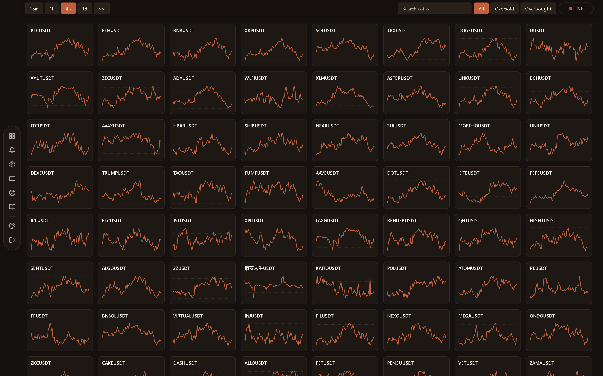
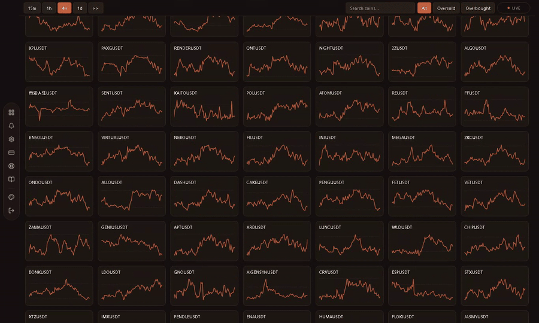
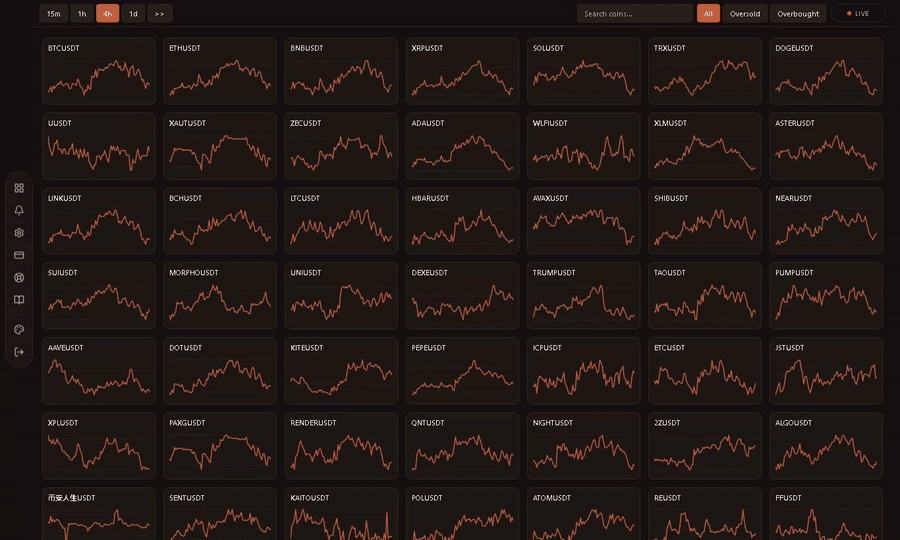
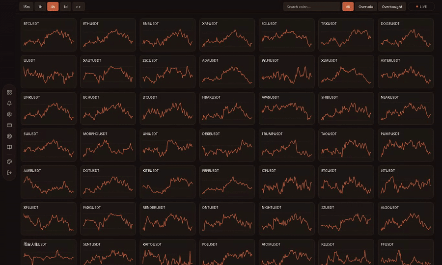
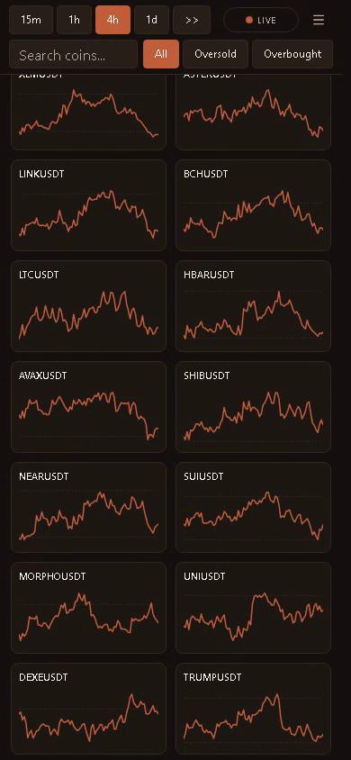
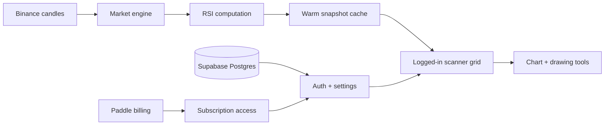

# RSI Screener

### Live RSI intelligence for the Binance spot market

Private production SaaS. Public product showcase.

  
  
  
  

<a href="https://hamad12-cmd.github.io/rsiscreener/"><strong>Open the full visual showcase</strong></a>
&nbsp;&nbsp;|&nbsp;&nbsp;
<a href="#demo-reel"><strong>Watch clips</strong></a>
&nbsp;&nbsp;|&nbsp;&nbsp;
<a href="#system-shape"><strong>Architecture</strong></a>

 

  

## Product Signal

RSI Screener is a logged-in market command center for traders who need to scan
hundreds of Binance spot pairs fast. The product turns RSI into a dense visual
wall: one tile per symbol, one mini-chart per pair, one toolbar for timeframe,
filters, search, and chart entry.

The public repository is intentionally source-free. It shows the product surface,
interaction flow, and architecture without exposing the private codebase.

 

## Demo Reel

### 01. Scan The Market Wall

Dense Terracotta grid. Every tile is a symbol. Every line is RSI movement.

  

### 02. Change Timeframe, Isolate Extremes

Move between RSI contexts, then dim everything except oversold or overbought
conditions.

  

### 03. Search Straight Into The Chart

Type a ticker, press enter, and jump from market wall to chart workflow.

  

### 04. Mark The Setup

Draw trendlines, pick colors, undo, redo, clear, and export the chart as PNG.

  

### 05. Mobile Scanner

The same scanner compressed into a phone layout with timeframe controls, search,
filters, live status, and a two-column grid.

  

 

## Built Surface

  
<strong>Market engine</strong> 
  Server-side RSI computation for Binance spot candles, designed so browsers do not hammer the exchange.

  
<strong>Warm scanner grid</strong> 
  Pre-computed snapshots feed a dense tile wall with timeframe switching, filters, search, and live status.

  
<strong>Chart workflow</strong> 
  Full RSI chart modal with drawing tools, color palette, undo/redo, clear, and PNG export.

  
<strong>SaaS layer</strong> 
  Auth, JWT sessions, user settings, protected access, Paddle billing, and responsive PWA shell.

 

## System Shape

The core design choice is centralization: the server owns market polling and RSI
calculation, then the UI reads compact snapshots. That keeps the tool responsive
and avoids scaling Binance requests with visitor count.

 

## Stack

`Next.js 16` &middot; `React` &middot; `TypeScript` &middot; `Tailwind CSS v4` &middot; `Supabase`
&middot; `Paddle` &middot; `JWT` &middot; `Vitest` &middot; `PWA` &middot; `Playwright`

 

  <strong>Want the polished version?</strong> 
  The GitHub Pages showcase is the intended portfolio view:
   
  <a href="https://hamad12-cmd.github.io/rsiscreener/">https://hamad12-cmd.github.io/rsiscreener/</a>

