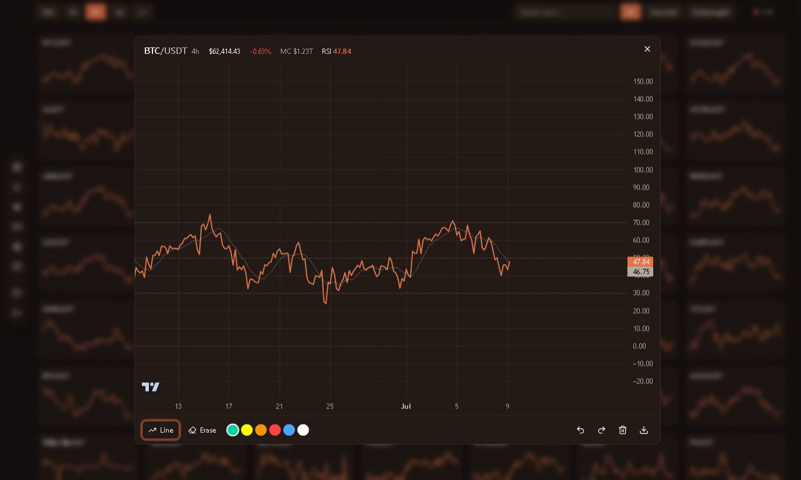
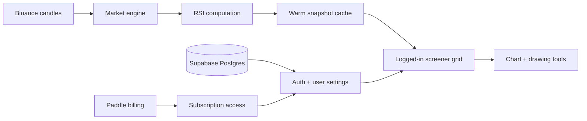

# RSI Screener

Private SaaS product showcase. Source code is not published in this repository.

  

## What It Is

RSI Screener is a logged-in market scanner for Binance spot pairs. It gives a
trader one dense view of live RSI movement instead of forcing them to open charts
one by one.

## 1. Market Grid Scrolling

The main surface is the grid: hundreds of symbols, each with its own RSI mini
chart, designed for scanning quickly.

  

## 2. Timeframes And Filters

Switch between short-term and higher-timeframe RSI, then isolate oversold or
overbought conditions directly from the toolbar.

  

## 3. Search To Chart

Search a symbol and press enter to jump from the grid into the full chart view.

  

## 4. Chart Drawing Tools

The chart view supports drawing trendlines, choosing colors, undo/redo, clearing
drawings, and exporting the setup as a PNG.

  

  

## 5. Mobile Scanner

The same tool compresses into a mobile layout with timeframe controls, search,
filters, live status, and a two-column tile grid.

  

## What I Built

- Server-side RSI engine for Binance spot market data
- Warm snapshot loading for the screener grid
- Timeframe switching across the tool
- Oversold and overbought filtering
- Symbol search and chart-opening flow
- RSI chart modal with drawing and export tools
- Email/password auth, JWT sessions, user settings, Paddle billing, and protected access
- Responsive desktop and mobile tool surfaces

## Architecture

## Stack

`Next.js 16` &middot; `React` &middot; `TypeScript` &middot; `Tailwind CSS v4` &middot; `Supabase`
&middot; `Paddle` &middot; `JWT` &middot; `Vitest` &middot; `PWA` &middot; `Playwright`
