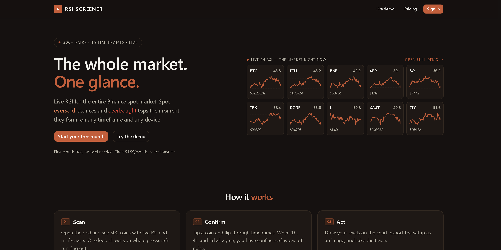
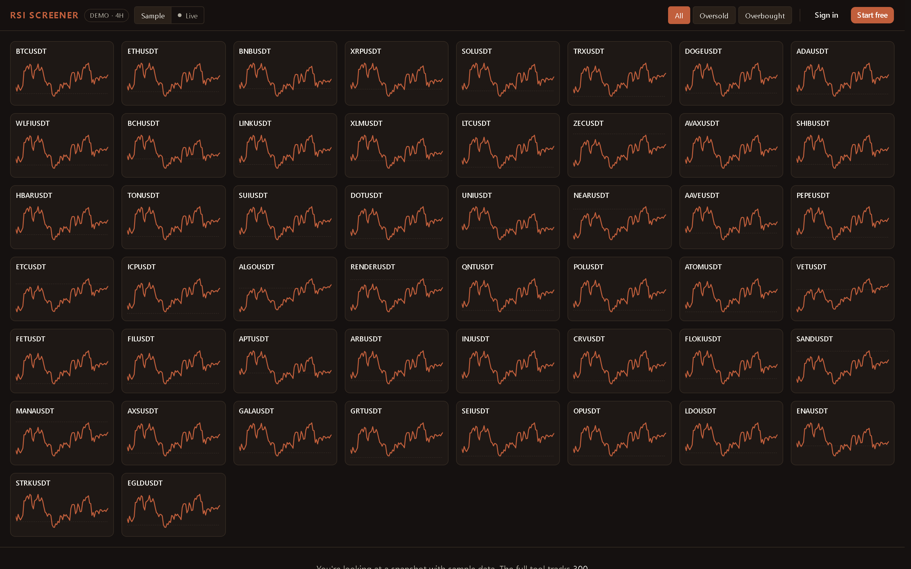
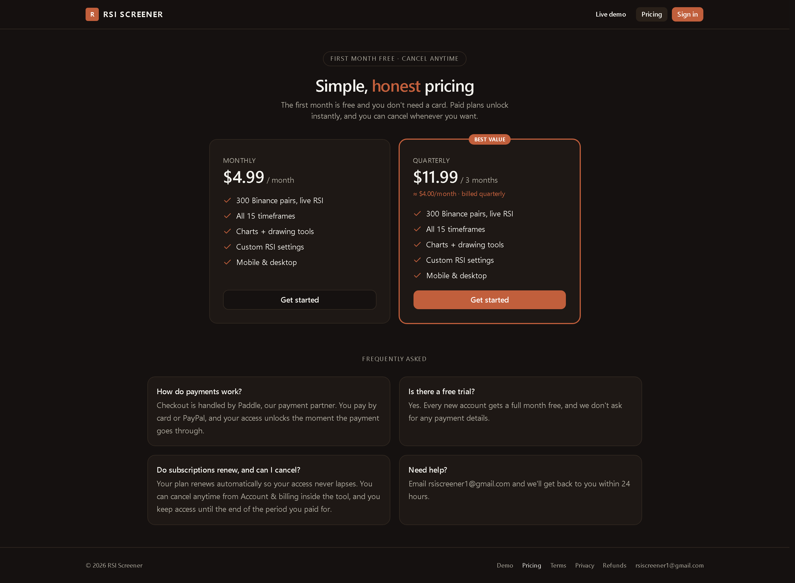

# RSI Screener

**Live RSI for the entire Binance spot market — the whole market at one glance.**

A production SaaS that computes the Relative Strength Index for 300+ Binance
spot pairs across 15 timeframes, server-side, and streams it to a fast, live
grid. Spot oversold bounces and overbought tops the moment they form, on any
timeframe and any device.

  

  <a href="#"><strong>Live demo &rarr;</strong></a>
  &nbsp;·&nbsp; First month free, no card required

> This repository is a **showcase**. It documents the product and how it's built.
> The application source is kept in a private repository.

---

## The problem

Traders watching for RSI extremes normally flip through charts one symbol at a
time, or pay for heavyweight terminals. There was no fast, focused way to see
*the whole market's* RSI at once, on the timeframe you care about, from a phone.

RSI Screener is that one screen: a live wall of every liquid Binance pair, each
with its current RSI and a mini-chart, filterable to oversold or overbought in a
single tap — then a full charting view to confirm the setup and mark it up.

---

## Features

| | |
|---|---|
| **Live RSI on 300+ pairs** | Market-cap-ranked Binance spot pairs, computed on the server so the client never touches an exchange rate limit. |
| **15 timeframes** | From 1-minute scalps to monthly swings. Switching is instant; the grid fills progressively as data lands. |
| **Full RSI charts** | Candlesticks with an RSI pane, moving average, zoom and pan — updating live while open. |
| **Drawing tools** | Trendlines with drag handles, undo/redo, a colour palette, and one-tap PNG export. Works with touch. |
| **Custom RSI settings** | Period and oversold/overbought thresholds per user, synced to the account. |
| **Installable PWA** | Add to home screen, fast shell load, and a graceful offline screen. |
| **Works everywhere** | Fully responsive — the same tool on phone, tablet and desktop, with tiny payloads for mobile data. |

  

---

## How it's built

A single, always-on Next.js server — no serverless cold starts — with a
background market engine feeding a live UI.

**Frontend**
- **Next.js 16** (App Router, React Server Components) + **TypeScript**
- **Tailwind CSS v4** and **shadcn/ui** for the component system
- A **custom canvas charting engine** (candles, RSI, drawing overlay, PNG export) — no charting library
- **PWA**: service worker with a cache-first app shell, offline fallback, and installability

**Backend & data**
- A **server-side market engine** that polls the public Binance API, computes RSI
  (Wilder's smoothing) for every tracked pair across all timeframes, and holds a
  **warm in-memory cache** aligned to candle closes — so page loads are instant and
  the exchange is hit once, centrally, instead of once per visitor
- **Supabase (Postgres)** for users, subscriptions and settings
- **JWT** sessions (HS256) with **email OTP** verification and password reset

**Payments**
- **Paddle** as merchant of record (card & PayPal), with an inline one-page checkout
- **Webhook-drift reconciliation**: subscription state is treated as source-of-truth
  in Paddle and *self-heals* on read — a missed webhook can never permanently lock out
  a paying customer or leave a cancelled one with access

**Quality**
- **Vitest** unit suite covering RSI math, webhook signature verification, rate
  limiting and input validation
- Rate limiting, per-user in-memory locks against race conditions, and strict input
  validation on every route

---

## A few engineering details I'm proud of

- **One exchange connection for everyone.** Instead of each browser calling Binance,
  the server maintains the market state and every visitor reads a small pre-computed
  snapshot. It scales with a warm cache rather than with user count.
- **Self-healing billing.** Webhooks fail — tunnels die, servers restart, deliveries
  exhaust their retries. Rather than trusting the webhook stream alone, the app
  reconciles each subscription against Paddle's live state when it's read, so the
  database can drift and still recover on its own.
- **Progressive, never-blank UI.** The grid renders immediately with whatever data
  is warm and fills in the rest, so there's no spinner wall on a 300-tile screen.

---

## Screenshots

<table>
  <tr>
    <td width="60%"></td>
    <td width="40%"></td>
  </tr>
</table>

---

## Tech stack

`Next.js 16` · `React` · `TypeScript` · `Tailwind CSS v4` · `shadcn/ui`
· `Supabase / Postgres` · `Paddle` · `JWT` · `Vitest` · `PWA`

---

Built and maintained by a self-taught developer. Source available on request.

