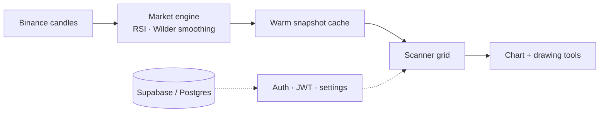

# RSI Screener

### Live RSI for the entire Binance spot market — the whole market at one glance.

  
  
  
  

 

> A production SaaS that computes RSI for **300+ Binance spot pairs across 15 timeframes**, on the server, and streams it to one dense live wall. Everything below is the **real logged-in product**, recorded live. The source code is private; this page shows the product and how it was built.

 

## Watch it work

**01 · Isolate the extremes**
Dim the entire wall to only the oversold or overbought names in one tap. The handful of pairs that matter light up while everything else fades back.

**02 · Search straight into the chart**
Type a ticker, press enter, and jump from the market wall into a full RSI chart with price history and a live reading, without leaving the keyboard.

**03 · Mark the setup**
A custom canvas charting engine, not a library. Draw trendlines, switch colours, undo, redo, clear, and export the chart to PNG.

 

## Engineering highlights

> **One connection for the whole market.**
> Instead of every browser calling the exchange, a single server computes RSI centrally and each visitor reads a small warm snapshot. It scales with a cache, not with the number of users.

> **A UI that is never blank.**
> The 300-tile wall paints whatever is already warm and fills the rest as it arrives. Filtering and search run client-side against the snapshot, so they are instant and never refetch.

> **Charts written from scratch.**
> A hand-built canvas engine renders the RSI line, moving average, zoom and pan, and a drawing overlay with trendlines, undo/redo and PNG export. No charting library.

> **Access that heals itself.**
> Subscription state reconciles against the billing provider on read, so a single missed webhook can never lock out a paying customer or leave a cancelled one with access.

 

## How it was built

A single always-on **Next.js 16** server (App Router, React Server Components) with a background market engine feeding a live UI. The guiding idea is **centralization**: the server does the market work once, and every visitor reads a small pre-computed result.

### The market engine
- Polls Binance's public REST API for candlesticks across every tracked pair and **all 15 timeframes**.
- Computes RSI with **Wilder's smoothing** (standard 14-period, configurable per user).
- Aligns work to **candle closes** — when a 4h candle closes, only the 4h set recomputes. That keeps data fresh, staggers load, and queries the exchange centrally instead of once per visitor.
- Holds results in a **warm in-memory cache** as compact snapshots, one per timeframe.

### Serving the scanner
- A request reads the warm snapshot for the chosen timeframe and returns a **tiny JSON payload** (symbol, RSI, sparkline, price) — no exchange call per visitor, fast even on mobile data.
- The grid renders **progressively** rather than blocking on a spinner across 300 tiles.
- **Filter and search are client-side**, so oversold/overbought and ticker search are instant and dim the tiles in place instead of reflowing.

### The chart
A hand-built **canvas rendering engine** with no charting library: RSI line and moving average, zoom and pan, and a drawing overlay for trendlines with undo/redo, a colour palette, and one-tap PNG export. It updates live while open.

### Accounts and data
- **Supabase (Postgres)** for users, subscriptions and synced settings, so theme, RSI period and thresholds follow the account.
- **JWT (HS256)** sessions, registration verified by **email OTP**, password reset by OTP.
- Subscriptions with a **self-healing access model**: billing state reconciles against the provider's live API on read, so the database can drift and still recover on its own.

### Delivery and hardening
- A **single always-on server**, not serverless — no cold starts, which suits a warm-cache engine that must stay hot.
- An installable **PWA** with a service-worker app-shell cache and a graceful offline screen.
- **Rate limiting**, per-user locks that close race conditions, and strict input validation on every route. A **Vitest** suite covers the RSI math, webhook signature verification and validation.

### Data flow

 

## Stack

  
  
  
  
  
  
  
  
  
  

Custom canvas charting engine · server-side market engine · warm-cache snapshots · email OTP auth · settings sync · installable PWA.

 

This repository is a showcase. It documents the product and how it works, without exposing the private source.

