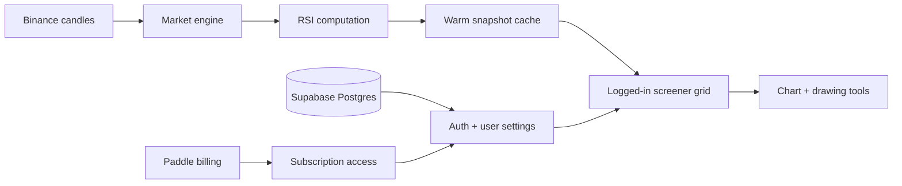

# RSI Screener

Private SaaS product showcase. Source code is not published in this repository.

  

## The Product

RSI Screener is a logged-in crypto market tool for scanning Binance spot pairs by
RSI. The main screen is a dense live grid: each tile is a pair, each line is its
RSI movement, and the toolbar lets you move between timeframes, search symbols,
and isolate oversold or overbought conditions.

  

## Chart Workflow

The full tool opens a coin into an RSI chart view with zoom/pan, drawing tools,
undo/redo, color selection, and PNG export.

  

## Mobile Tool

The same scanner works as a compact mobile interface with the timeframe row,
search, filters, live status, and full tile grid.

  

## What I Built

- Server-side RSI engine for Binance spot market data
- Dense scanner grid for 300+ symbols
- Timeframe switching and warm snapshot loading
- Oversold / overbought filters
- Symbol search and chart opening flow
- RSI chart modal with drawing and export tools
- Email/password auth, JWT sessions, user settings, Paddle billing, and protected access

## Architecture

## Stack

`Next.js 16` &middot; `React` &middot; `TypeScript` &middot; `Tailwind CSS v4` &middot; `Supabase`
&middot; `Paddle` &middot; `JWT` &middot; `Vitest` &middot; `PWA` &middot; `Playwright`
