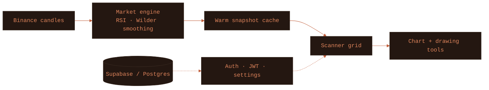

You pressed the crate. This is what's inside: a production SaaS that computes RSI for **300+ Binance spot pairs across 15 timeframes** on the server and streams it to one dense live wall. Every frame below is the real logged-in product, captured live. The source is private; this page shows the product and how it's built.

 

## A tour in three frames

  
  
  

One tap isolates the overbought or oversold names while the rest of the wall dims back. Search lands straight in a full RSI chart with a live reading. And the hand-built canvas engine draws trendlines with undo, redo and PNG export. Press a frame for the full-resolution capture.

 

## How it works

One always-on **Next.js 16** server (App Router, React Server Components) with a background market engine feeding a live UI. The guiding idea is **centralization**: the server does the market work once, and every visitor reads a small pre-computed result.

### The market engine
- Polls Binance's public REST API for candlesticks across every tracked pair and all 15 timeframes.
- Computes RSI with **Wilder's smoothing** (standard 14-period, configurable per user).
- Aligns work to **candle closes** — when a 4h candle closes, only the 4h set recomputes. Data stays fresh, load stays staggered, and the exchange is queried centrally instead of once per visitor.
- Holds results in a **warm in-memory cache** as compact snapshots, one per timeframe.

### Serving the scanner
- A request reads the warm snapshot and returns a tiny JSON payload (symbol, RSI, sparkline, price) — no exchange call per visitor, fast even on mobile data.
- The 300-tile wall paints whatever is already warm and fills the rest as it arrives — never a blank screen behind a spinner.
- **Filter and search run client-side** against the snapshot, so they are instant and dim tiles in place instead of refetching.

### The chart
A hand-built **canvas rendering engine** with no charting library: RSI line and moving average, zoom and pan, and a drawing overlay for trendlines with undo/redo, a colour palette, and one-tap PNG export. It updates live while open.

### Accounts and access
- **Supabase (Postgres)** for users, subscriptions and synced settings — theme, RSI period and thresholds follow the account.
- **JWT (HS256)** sessions; registration and password reset verified by **email OTP**.
- **Self-healing access**: subscription state reconciles against the billing provider's live API on read, so a single missed webhook can never lock out a paying customer or leave a cancelled one with access.

### Delivery and hardening
- A single always-on server, not serverless — no cold starts, which suits a warm-cache engine that must stay hot.
- Installable **PWA** with a service-worker app-shell cache and a graceful offline screen.
- **Rate limiting**, per-user locks that close race conditions, and strict input validation on every route. A **Vitest** suite covers the RSI math, webhook signature verification and validation.

### Data flow

 

<samp>Next.js 16 · React · TypeScript · Tailwind v4 · shadcn/ui · Supabase · Postgres · JWT · Vitest · PWA</samp>

Built by <a href="https://github.com/hamad-naeem">Hamad Naeem</a> with AI-assisted development. This repository documents the product without exposing the private source.

