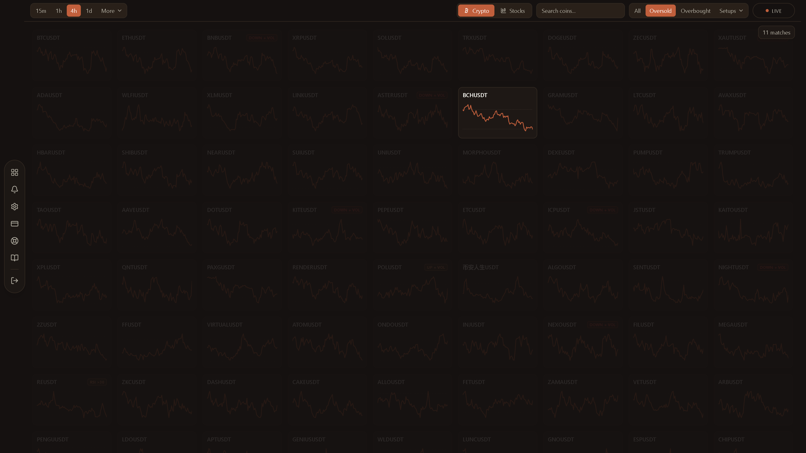
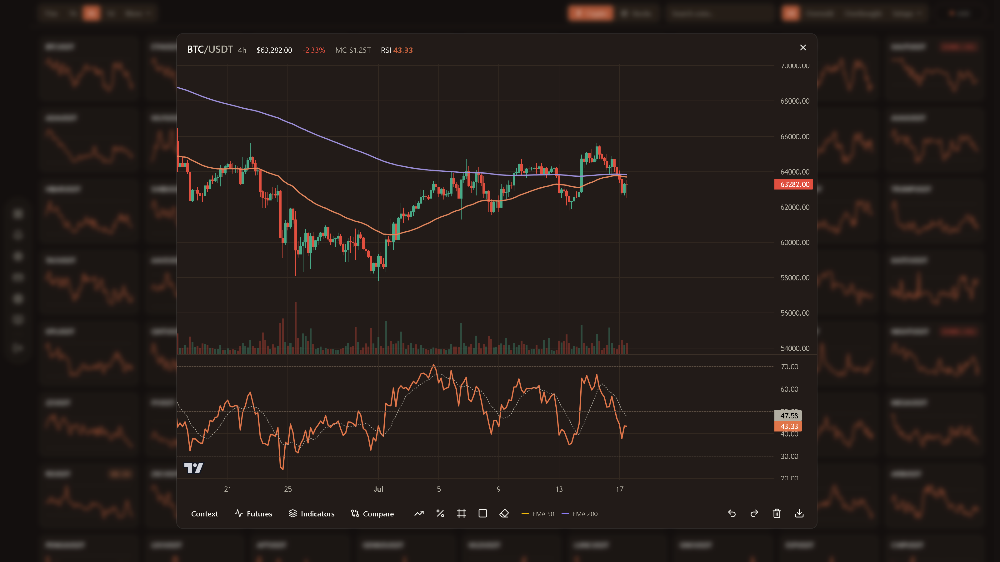
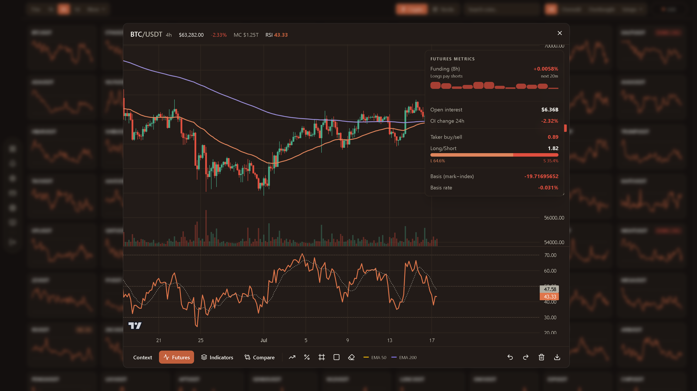
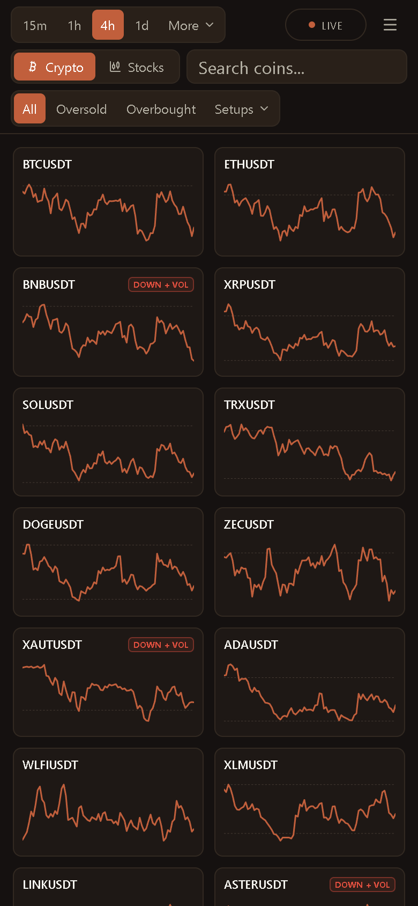

<a href="https://rsiscreener.me"><samp><b>rsiscreener.me</b></samp></a> · <samp>live in production · free plan, no card required</samp>

 

RSI Screener is a production SaaS, live at [rsiscreener.me](https://rsiscreener.me). It computes RSI for 300+ Binance spot pairs, crypto and tokenized stocks, across 15 timeframes, about 4,500 live series, and serves them as one grid that updates within seconds of each candle close. Every account starts on a free plan; Pro unlocks the full universe and the analysis features. The source is private. This page documents the product and its design; every capture below is the logged-in product.

 

  
  
  

Filtering, charting, and live derivatives context. Click a frame for the full-resolution capture.

 

## Design

A single always-on Next.js server runs a background market engine. The engine polls Binance's REST API, computes RSI with Wilder's smoothing (14-period, configurable per user), and recomputes each timeframe when its candle closes; a 4h close triggers only the 4h set. Results are held in memory as per-timeframe snapshots. Each snapshot is also scanned for trade setups (bullish and bearish divergence, RSI extreme exits, trend plus volume), which appear as badges on the grid.

Visitor requests read the snapshot; nothing a visitor does touches the exchange. Responses are small JSON payloads: symbol, RSI, price, sparkline. Filtering and ticker search run client-side against data already in the browser, and the grid renders progressively from whatever is warm. The server runs as one persistent process rather than serverless functions because the cache has to outlive the request.

The chart is built on TradingView's Lightweight Charts: synced price, volume, and RSI panes, live while open, with a drawing layer written for this product — trendlines, Fibonacci retracement with the golden pocket, price ranges, supply/demand zones, undo/redo and PNG export, all anchored in chart-domain coordinates so they survive zoom and pan. Any other coin can be overlaid on the price pane on its own auto-scaled axis to read relative strength. Seven configurable indicators (two moving averages, Bollinger Bands, Supertrend, rolling VWAP, MACD, Stochastic RSI) are computed in the browser from candles already on hand, so changing a parameter redraws instantly and adds no server load.

A futures panel adds live derivatives context for the open coin, pulled from Binance's public USDT-M futures API: funding rate and its recent history, open interest and 24-hour change, taker buy/sell flow, long/short account ratio, and basis. Calls are proxied through the server (shared with the same rate-limit guards as the spot engine), cached briefly, and gated on the perpetual existing, so a symbol with no futures market degrades cleanly instead of erroring.

The plans are enforced where it matters. Free accounts get the top 50 pairs with RSI and Stochastic RSI; Pro gets all 300 pairs, tokenized stocks, every indicator, the futures panel, setup context, and coin comparison. The API applies the caps itself — the interface only reflects them, so a hand-crafted request cannot reach past its tier. Account preferences (timeframe, thresholds, theme) live server-side and ride along with the page render, so a second device opens exactly where the first left off, with no settings flash.

Auth is JWT (HS256), with email OTP for registration and password reset. Subscription state is reconciled against the billing provider's API on read instead of trusting webhook delivery, so a dropped webhook cannot produce incorrect access in either direction.

All routes are rate-limited and validated. Per-user locks serialize the operations where a race could grant or revoke access incorrectly. Vitest covers the RSI math, webhook signature verification, and input validation.

<samp>binance → engine → warm cache → grid → chart</samp>

 

  

The same wall on a phone. The grid, chart, and panels are fully responsive.

 

<samp>Next.js 16 · React · TypeScript · Tailwind v4 · shadcn/ui · Lightweight Charts · Supabase · Postgres · JWT · Paddle · Vitest · PWA</samp>

Built by <a href="https://github.com/hamad-naeem">Hamad Naeem</a>. This repository documents the product without exposing the private source.

