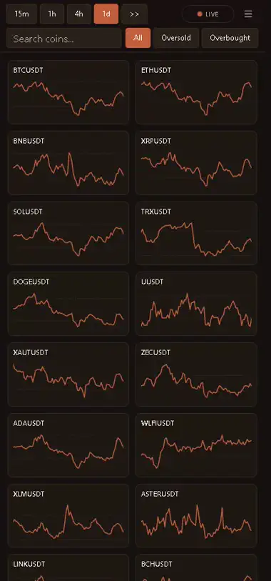
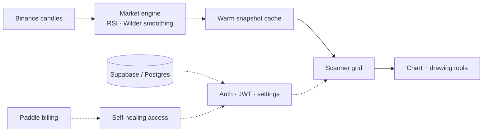

# RSI Screener

### Live RSI for the entire Binance spot market. The whole market at one glance.

  
  
  
  

A production SaaS that computes RSI for 300+ Binance pairs across 15 timeframes, server-side, and streams it to a live scanner. Everything here is the real logged-in tool. The source stays private.

 

> **The polished version lives here → [hamad12-cmd.github.io/rsiscreener](https://hamad12-cmd.github.io/rsiscreener/)**
> A full video showcase of the product. The clips below are lightweight previews of the same thing.

 

## See it work

**Isolate the extremes** — dim the whole wall to only the oversold or overbought names in one tap.

**Search straight into the chart** — type a ticker, press enter, land in a full RSI chart.

**Mark the setup** — a custom canvas chart with trendlines, colours, undo/redo and PNG export.

**On any device** — the same scanner folds down to a two-column wall on a phone, with the timeframe strip, search, filters and live status intact.

## How it fits together

The core design choice is centralization: the server owns market polling and RSI math, and every visitor
reads a small warm snapshot. It scales with a cache, not with the number of users.

A single always-on Next.js server, no serverless cold starts. Webhooks can be missed, so subscription state
reconciles against Paddle on read: a paying customer is never locked out by a dropped event.

## Built with

  
  
  
  
  
  
  
  
  

Custom canvas charting engine · server-side market engine · warm-cache snapshots · email OTP auth · settings sync · installable PWA.

 

This repository is a showcase. It documents the product and how it is built, without exposing the private source. 
Built by Hamad · <a href="https://hamad12-cmd.github.io/rsiscreener/">view the full showcase</a>

