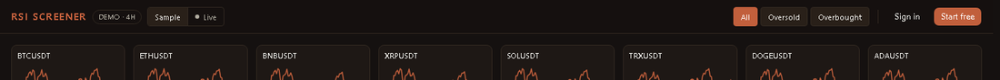
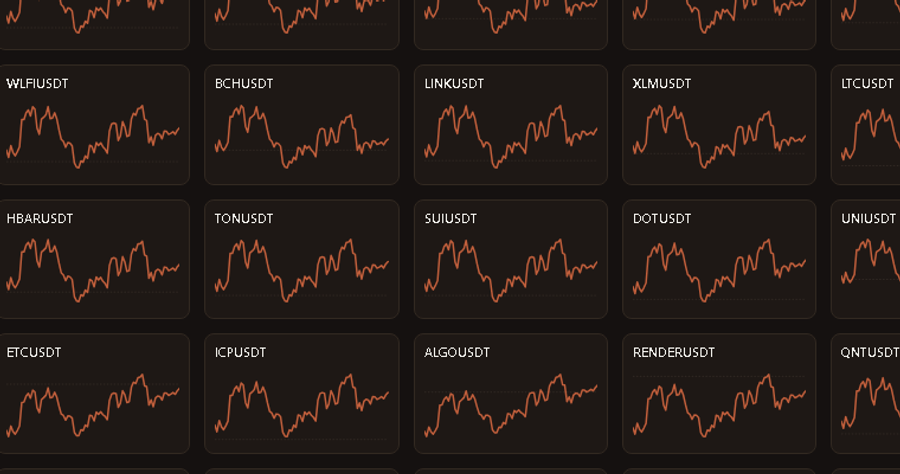
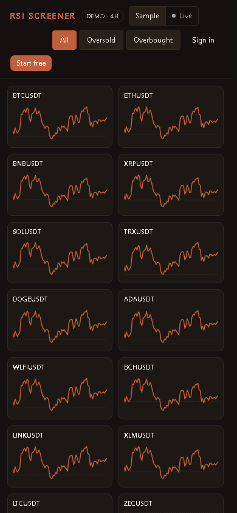
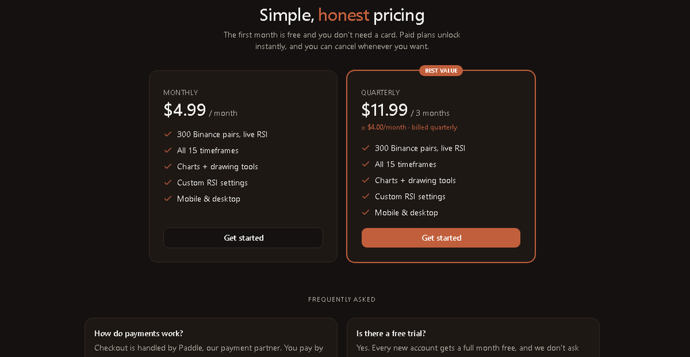
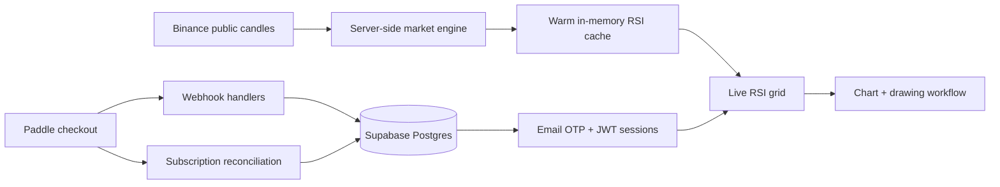

# RSI Screener

> Public showcase for a private production SaaS. No source code is published here.

  

## One Screen For The Whole Crypto Market

RSI Screener scans the Binance spot market and turns hundreds of RSI readings
into one fast visual grid. It is built for the moment when a trader wants to
know, immediately, which pairs are overheated, washed out, or moving together
across timeframes.

  

## What It Does

| Product surface | Built behavior |
|---|---|
| **300+ pair grid** | Every tile shows a symbol and mini RSI curve, so the market can be scanned like a heatmap. |
| **Live Binance mode** | Public demo can switch from sample data to live Binance-backed RSI data. |
| **15 timeframe engine** | The private tool tracks short scalps through monthly swings. |
| **Chart workflow** | Open a coin, inspect RSI, draw trendlines, undo/redo, and export the setup. |
| **Account system** | Email OTP, JWT sessions, user settings, subscription state, and protected tool access. |
| **Billing flow** | Paddle checkout and webhook reconciliation for paid access. |

## Real UI Zooms

<table>
  <tr>
    <td width="50%"></td>
    <td width="50%"></td>
  </tr>
  <tr>
    <td width="50%"></td>
    <td width="50%"></td>
  </tr>
</table>

## Architecture

The important decision: browsers do not hammer Binance. The server computes and
holds market state once, then the UI reads small snapshots. That keeps page loads
fast and avoids scaling exchange requests with visitor count.

## Engineering Highlights

- **Warm snapshot loading:** the grid renders immediately from available market state and fills progressively.
- **RSI computation server-side:** RSI is computed centrally using Wilder-style smoothing.
- **Protected SaaS flow:** auth, settings, payments, subscription checks, and paywall states are wired into the product.
- **Responsive PWA shell:** the same scanner is usable on desktop and phone.
- **Real chart tooling:** chart modal supports zoom/pan, drawing overlays, undo/redo, and PNG export in the private app.

## Stack

`Next.js 16` &middot; `React` &middot; `TypeScript` &middot; `Tailwind CSS v4` &middot; `Supabase`
&middot; `Paddle` &middot; `JWT` &middot; `Vitest` &middot; `PWA` &middot; `Playwright`

---

Built as an end-to-end SaaS: product UI, market data engine, auth, billing, and deployment workflow.
