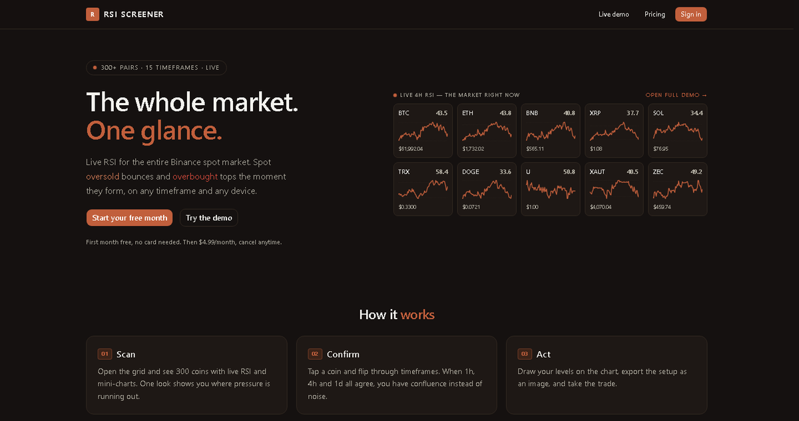
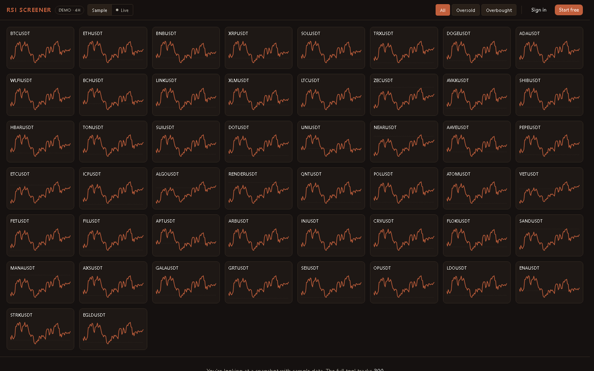
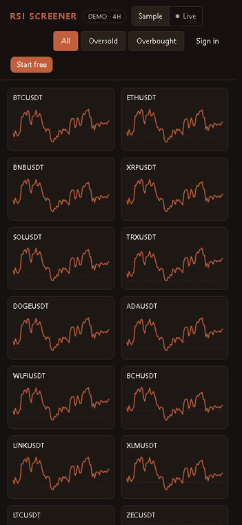
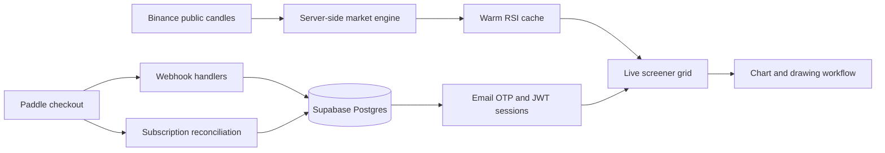
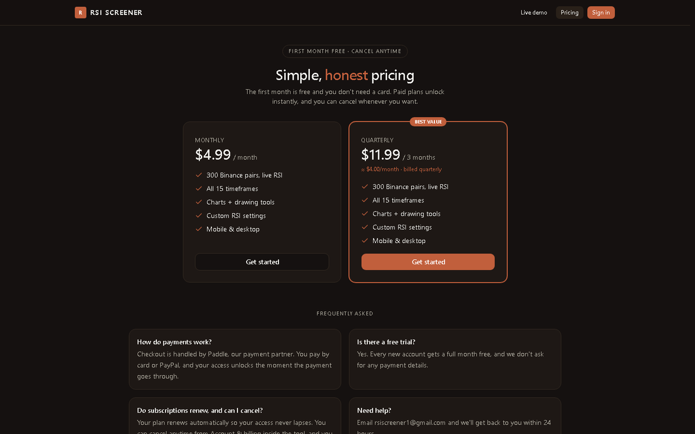

# RSI Screener

Public showcase for a private production SaaS.

  

## What This Is

RSI Screener is a crypto market scanner for Binance spot pairs. It turns hundreds
of RSI readings into one visual grid, so a trader can scan the whole market
instead of opening chart after chart.

The source code is private. This repository shows the product, the workflow, and
the engineering shape behind it.

## Desktop Scanner

  

  

## Mobile

  

## Product Scope

- 300+ Binance spot pairs in one grid
- RSI mini-chart per symbol
- Oversold and overbought filters
- Sample and live demo modes
- Private full tool with 15 timeframes
- Chart modal with zoom, pan, drawing tools, undo/redo, and PNG export
- Email OTP auth, JWT sessions, user settings, Paddle billing, and protected access

## Architecture

The main backend decision is simple: browsers do not call Binance directly for
every tile. The server computes market state once, keeps it warm, and the UI
reads small snapshots.

## Stack

`Next.js 16` &middot; `React` &middot; `TypeScript` &middot; `Tailwind CSS v4` &middot; `Supabase`
&middot; `Paddle` &middot; `JWT` &middot; `Vitest` &middot; `PWA` &middot; `Playwright`

## Pricing Surface

  

