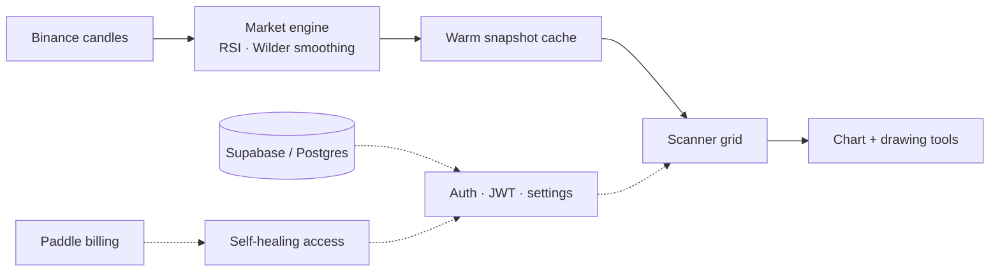

# RSI Screener

### Live RSI for the entire Binance spot market. The whole market at one glance.

  
  
  
  

RSI Screener is a production SaaS that computes the Relative Strength Index for **300+ Binance spot pairs across 15 timeframes**, on the server, and streams it to a dense live scanner. You read where momentum is stretching across the whole market in a single glance, then drill into any pair for a full chart.

Everything shown here is the **real logged-in product**, recorded live on the Terracotta theme. The source code is private; this page documents the product and how it is built.

 

## See it work

### Isolate the extremes
Dim the entire wall down to only the oversold or overbought names in one tap. The handful of pairs that matter light up while everything else fades back.

### Search straight into the chart
Type a ticker, press enter, and jump from the market wall into a full RSI chart with price history and a live reading, without leaving the keyboard.

### Mark the setup
A custom canvas charting engine, not a library. Draw trendlines, switch colours, undo, redo, clear, and export the chart to PNG.

### Fully responsive on mobile
The same scanner folds down to a two-column wall on a phone, keeping the timeframe strip, search, filters, live status and full charting. It is an installable PWA, so it can live on the home screen and open like an app.

 

## How it is built

A single always-on **Next.js 16** server (App Router, React Server Components) with a background market engine feeding a live UI. The guiding idea is **centralization**: the server does the market work once, and every visitor reads a small pre-computed result.

### The market engine
If every browser called Binance directly, each user would hit rate limits and pages would crawl. Instead one server-side engine owns all market data:

- It polls Binance's public REST API for candlesticks (klines) across every tracked pair and **all 15 timeframes**.
- For each series it computes RSI with **Wilder's smoothing** (the standard 14-period calculation, and the period is configurable per user).
- Work is **aligned to candle closes**: when a 4h candle closes, only the 4h set recomputes. That keeps data fresh, staggers the load, and means the exchange is queried centrally rather than once per visitor.
- Results are held in a **warm in-memory cache** as compact snapshots, one per timeframe.

### Serving the scanner
- A page request reads the warm snapshot for the chosen timeframe and returns a **tiny JSON payload** (symbol, RSI, sparkline points, price). No exchange call happens per visitor, so it stays fast even on mobile data.
- The grid renders **progressively**: it paints whatever is already warm and fills the rest as it arrives, so there is never a spinner wall on 300 tiles.
- **Filtering and search run client-side** against the snapshot, so oversold/overbought and ticker search are instant and never refetch. The tiles dim in place instead of reflowing.

### The chart
A hand-built **canvas rendering engine** with no charting library: the RSI line and moving average, zoom and pan, and a drawing overlay for trendlines with undo/redo, a colour palette, and one-tap PNG export. It updates live while open.

### Accounts, data and billing
- **Supabase (Postgres)** stores users, subscriptions and synced settings, so your theme, RSI period and thresholds follow your account.
- **JWT (HS256)** sessions, with registration verified by **email OTP** and password reset by OTP.
- **Paddle** is the merchant of record (card and PayPal) with an inline one-page checkout.
- **Self-healing billing:** webhooks can be missed (a server restart, a dropped delivery). So subscription state is **reconciled against Paddle's live API on read** — if the database has drifted, it heals itself, and a paying customer is never locked out by a lost event.

### Delivery and hardening
- A **single always-on server**, not serverless: no cold starts, which suits a warm-cache engine that must stay hot.
- An installable **PWA** with a service-worker app-shell cache and a graceful offline screen.
- **Rate limiting**, per-user in-memory locks that close race conditions (for example, double-claiming the free month), and strict input validation on every route. A **Vitest** suite covers the RSI math, webhook signature verification, and validation.

### Data flow

 

## Stack

  
  
  
  
  
  
  
  
  
  
  

Custom canvas charting engine · server-side market engine · warm-cache snapshots · email OTP auth · settings sync · installable PWA.

 

This repository is a showcase. It documents the product and how it works, without exposing the private source.

