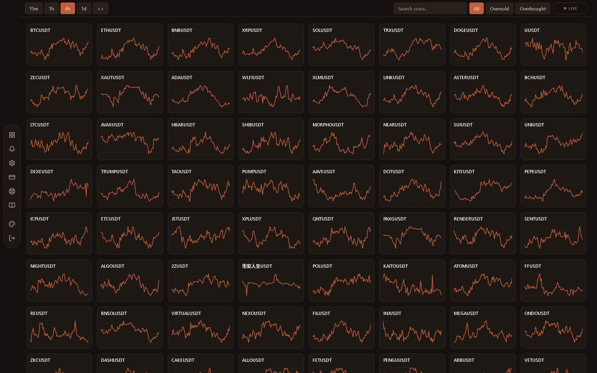
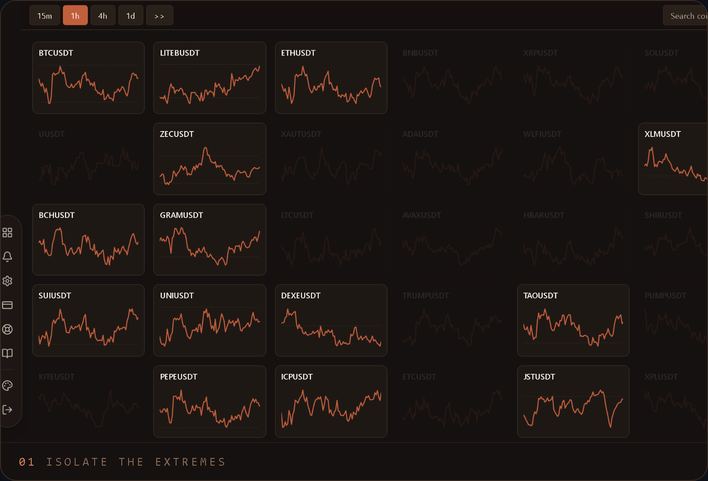
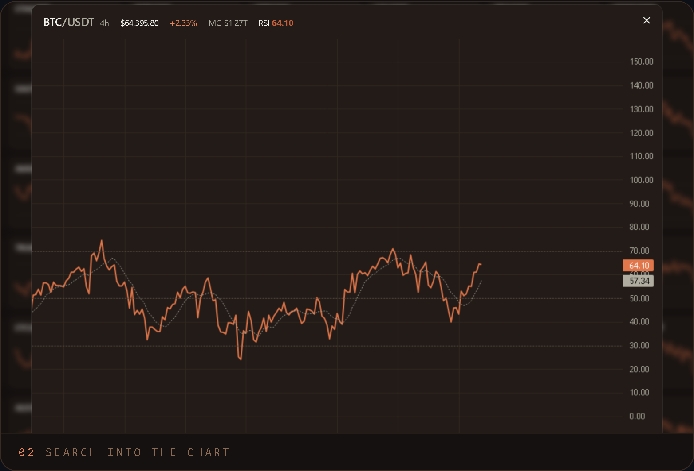
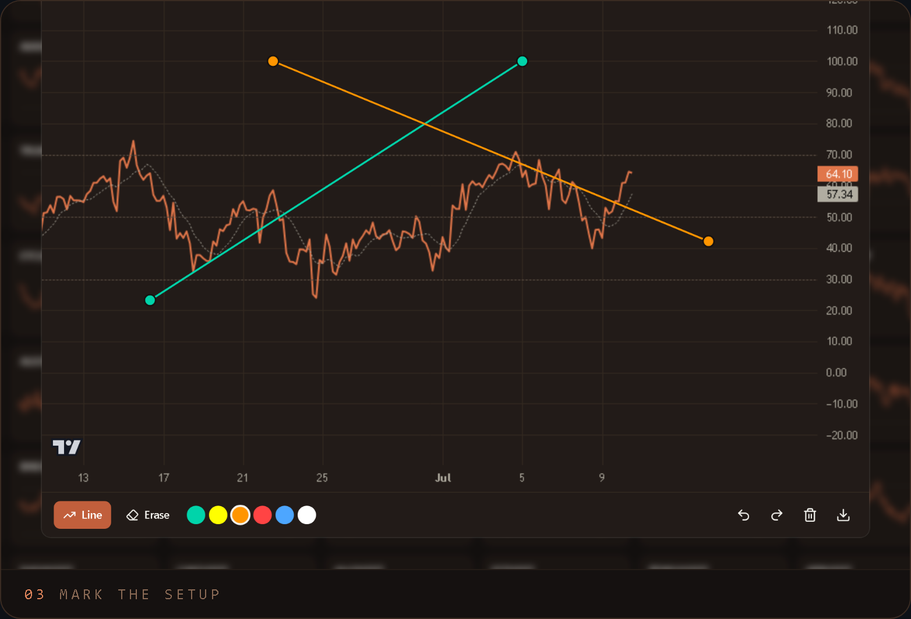

You pressed the crate. This is what's inside — the real logged-in product, captured live. Source private.

 

  
  
  

One tap isolates the extremes. Search lands straight in the chart. Trendlines are drawn on a hand-built canvas engine. Press a frame for full resolution.

 

## How it works

**The server does the market work once. Every visitor reads a warm snapshot.**

- A background engine polls Binance and recomputes RSI (Wilder's, 14-period) the moment each candle closes
- Results sit in an in-memory cache as compact per-timeframe snapshots; every response is tiny JSON
- The wall paints progressively, never a spinner; filter and search run client-side, so they're instant
- The chart is a hand-built canvas engine: zoom, pan, trendlines, undo/redo, PNG export, live while open
- JWT sessions with email OTP; subscription access self-heals against the billing API on every read
- Rate limits, per-user locks, strict validation; Vitest covers the RSI math and webhook signatures

<samp>binance → engine → warm cache → wall → chart</samp>

 

<samp>Next.js 16 · React · TypeScript · Tailwind v4 · shadcn/ui · Supabase · Postgres · JWT · Vitest · PWA</samp>

Built by <a href="https://github.com/hamad-naeem">Hamad Naeem</a> with AI-assisted development. This repository documents the product without exposing the private source.

